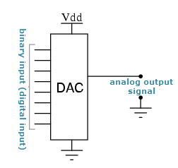

# Digital to Analog Converter (DAC)

Digital to Analog Converter (DAC) is a device that transforms
digital data into an analog signal. According to the Nyquist-Shannon
sampling theorem, any sampled data can be reconstructed perfectly 
with bandwidth and Nyquist criteria.

A DAC can reconstruct sampled data into an analog signal with precision.
The digital data may be produced from a microprocessor, Application
Specific Integrated Circuit (ASIC), or Field Programmable Gate Array (FPGA),
but ultimately the data requires the conversion to an analog signal in
order to interact with the real world.

## Applications of Digital to Analog Converter

DACs are used in many digital signal processing applications and
many more applications. Some of the important applications are
discussed below.
-   Audio Amplifier
-   Video Encoder
-   Display Electronics
-   Data Acquisition Systems
-   Calibration
-   Motor Control
-   Data Distribution System
-   Software Radio
